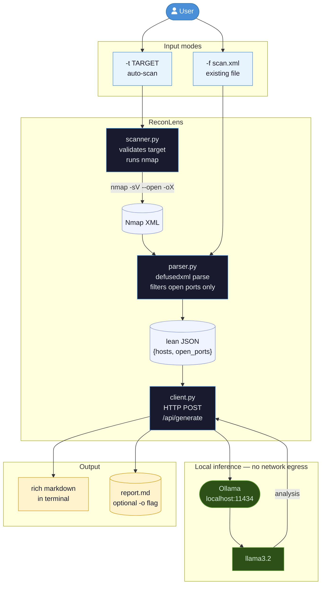

# ReconLens

Lightweight CLI tool that runs Nmap scans and delivers prioritized vulnerability insights — fully offline, no cloud, no API keys.

```
nmap -sV --open  →  lean JSON  →  llama3.2 (Ollama)  →  rich markdown report
```

---

## Features

- Auto-scan mode: point ReconLens at a target IP or range and it runs nmap, then analyzes automatically
- Manual mode: feed any existing Nmap XML file.
- 100% local: all inference runs on `localhost:11434` via Ollama, zero data leaves the machine
- Prioritized output: Critical / High / Recommendations ranked by exploitability
- Safe XML parsing: `defusedxml` blocks XXE, DTD injection, and billion-laughs attacks
- Save reports to markdown with `-o`

---

## Requirements

| Dependency | Version |
|------------|---------|
| Python | 3.10+ |
| [Ollama](https://ollama.com) | any |
| [Nmap](https://nmap.org) | any (for `--target` mode) |

---

## Installation

```bash
# 1. Clone
git clone https://github.com/chl70n/ReconLens.git
cd ReconLens

# 2. Install Python deps
pip install -r requirements.txt

# 3. Start Ollama and pull model
ollama serve
ollama pull llama3.2
```

---

## Usage

### Auto-scan a target (nmap + analysis in one command)

```bash
python main.py -t 192.168.1.1
python main.py -t 192.168.1.0/24
python main.py -t scanme.nmap.org
```

### Analyze an existing Nmap XML file

```bash
python main.py -f scan.xml
```

### Flags

| Flag | Description |
|------|-------------|
| `-t / --target` | Auto-scan: run nmap against target then analyze |
| `-f / --file` | Parse existing Nmap XML file |
| `-o / --output` | Save report to markdown file |
| `-v / --verbose` | Print compressed JSON payload before querying |

### Full pipeline example

```bash
python main.py -t 10.0.0.0/24 -v -o report.md
```

---

## Output Example

```
ReconLens — Nmap → Ollama Vulnerability Insights
Model: llama3.2 (local · ollama)
──────────────────────────────────────────────────
Auto-scan mode · target: 10.0.0.2
Running: nmap -sV --open 10.0.0.2
✓ Scan complete
✓ 1 host(s) · 3 open port(s) extracted

Querying llama3.2 via Ollama...
──────────────────────────────────────────────────

## 🔴 CRITICAL FINDINGS
- **vsftpd 2.3.4** (port 21) — CVE-2011-2523: backdoor shell on port 6200
- **Telnet** (port 23) — plaintext protocol, trivially MitM'd

## 🟠 HIGH PRIORITY
- **SMB / microsoft-ds** (port 445) — Windows 7 EOL, EternalBlue-class exposure

## 🟡 RECOMMENDATIONS
- Disable vsftpd immediately, replace with SFTP
- Block port 23 at firewall, enforce SSH only
- Patch or isolate the Windows 7 host; apply MS17-010
```

---

## How it works



---

## Project Structure

```
ReconLens/
├── main.py          # CLI entry point (--file / --target)
├── scanner.py       # nmap runner with target validation
├── parser.py        # Nmap XML → lean dict (defusedxml)
├── config.py        # Ollama URL, model name, system prompt
├── client.py        # HTTP POST to Ollama API
├── requirements.txt
└── samples/
    └── sample.xml   # Test scan (3 hosts, varied services)
```

---

## Troubleshooting

**`Cannot reach Ollama at http://localhost:11434`**
```bash
ollama serve   # start the daemon
```

**`nmap not found in PATH`**
- Windows: install from [nmap.org](https://nmap.org/download.html) and ensure it's in PATH
- Linux: `sudo apt install nmap`
- macOS: `brew install nmap`

**Scan returns no hosts**
- Some systems require root/admin for SYN scan: `sudo python main.py -t <target>`
- TCP connect scan works without root and is the default for unprivileged users

---

## License

MIT
